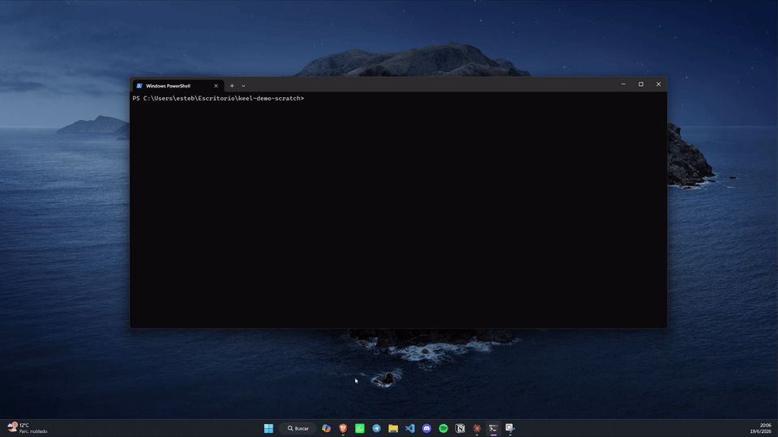
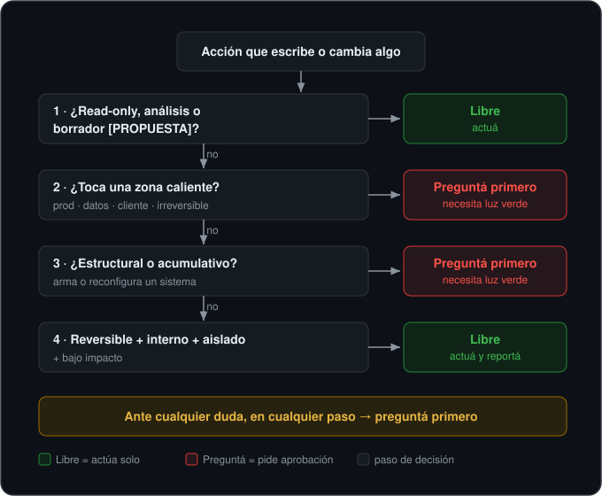

# Keel Skills — operación disciplinada para agentes de Claude

> *Read this in [English](README.md).*

> Un marco portable de gobernanza para correr agentes de Claude (Claude Code,
> Agent SDK) sin romper cosas ni quemar tokens. Tres skills + un comando, listos
> para instalar y configurar por proyecto.
>
> **Keel Skills es la metodología de gobernanza de agentes de [Esteban Aguilar](#autor).**
> Nace de operar agentes en producción todos los días, no de la teoría.

Keel Skills toma su nombre de la quilla del barco (*keel*): la pieza que no se ve pero mantiene todo estable y en
rumbo. Eso hace este plugin con un agente: lo deja moverse rápido en lo seguro y lo
frena en seco antes de lo irreversible.



*Al agente le dijeron "limpiá y pusheá". Sin una regla, lo hace —borra, force-push,
listo—. Con Keel toca una zona caliente, frena y propone un plan acotado, marcando
el borrado peligroso. ([recorrido completo](examples/l3-brake.md))*

> **En palabras simples.** Los asistentes de IA que escriben código ya pueden actuar
> solos — y a veces hacen algo que no se puede deshacer, como borrar trabajo para
> siempre o publicar un cambio en el sistema en vivo antes de que alguien lo revise.
> Keel Skills es un conjunto de reglas de la casa: deja que el asistente haga lo
> chico y seguro por su cuenta, pero lo obliga a **frenar y preguntarte primero**
> antes de cualquier cosa riesgosa o permanente. Vos mantenés el control sin tener
> que vigilar cada paso.

## El problema que resuelve

Un agente con autonomía es útil hasta que toca producción, sobrescribe algo
publicado, ejecuta un `push`/deploy que no correspondía, o gasta el presupuesto de
tokens corriendo el modelo más caro en una tarea mecánica. La mayoría de los
equipos no tiene un criterio **explícito** de cuándo el agente puede actuar solo y
cuándo tiene que parar y preguntar. Keel Skills es ese criterio, ya escrito.

Casi siempre te das cuenta de que lo necesitabas el día *después* del push que no
correspondía. La idea de Keel Skills es tenerlo puesto antes de ese día.

## Qué incluye

Tres skills (se activan solas cuando la situación lo amerita), un comando y un hook:

| Componente | Para qué |
|-----------|----------|
| **`authorization-protocol`** | Decide si el agente puede ejecutar o tiene que pedir aprobación. Modelo de 3 niveles (mandato amplio / mecanismo / aprobación explícita con scope), test de 4 pasos, zonas calientes y regla de propagación mecánica. |
| **`model-delegation`** | Elegir el modelo más barato que preserve calidad y riesgo. Tiers por tipo de tarea, profundidad máxima de subagentes, prohibición de auto-escalar, y escalera de herramientas más-barata-primero. |
| **`context-discipline`** | Mantener la sesión anclada en archivos y no en el chat. Cuándo cortar una sesión larga, qué registrar y cómo dejar un punto de retomado para una sesión nueva. |
| **`/keel-skills:policy-init`** | Genera el `AGENT_POLICY.md` de tu proyecto entrevistándote sobre tus zonas calientes y fuentes de verdad. |
| **hook `SessionStart`** | Si tu proyecto tiene un `AGENT_POLICY.md`, lo inyecta automáticamente al contexto al abrir cada sesión. Así la política deja de depender de que el agente "se acuerde" de leerla. |

## El modelo de autorización, de un vistazo

El corazón de Keel Skills: un test de cuatro pasos que decide, antes de cada acción
que escribe o cambia algo, si el agente puede actuar solo o tiene que parar y pedir
aprobación explícita (L3).



El modelo está especificado de forma neutral al runtime en **[SPEC.md](SPEC.md)**,
para que pueda citarse y reimplementarse fuera de Claude Code.

## La separación clave: mecanismo vs. tus datos

Las skills son **genéricas**: describen el *patrón* (qué es una zona caliente, qué
significa propagación mecánica, cómo se elige un modelo). Lo específico de tu
proyecto —qué rutas son calientes, dónde vive tu fuente de verdad, qué cuenta como
release— vive en un único archivo que vos controlás: **`AGENT_POLICY.md`** en la
raíz de tu proyecto.

Resultado: el producto se distribuye limpio, sin nada de tu empresa adentro, y cada
usuario lo configura para lo suyo. La plantilla está en
`plugins/keel-skills/templates/AGENT_POLICY.template.md`, y hay packs listos para
stacks comunes en [`policies/`](policies/).

## Instalación

Keel Skills se distribuye como un marketplace de un solo plugin.

```text
# En Claude Code:
/plugin marketplace add https://github.com/quitohooded/keel-skills
/plugin install keel-skills@keel-skills
```

Después, en tu proyecto:

```text
/keel-skills:policy-init
```

para generar el `AGENT_POLICY.md`. Ver `DISTRIBUTION.md` para las rutas de
publicación (repo git, ruta local, o paquete).

## Cómo usarlo, en una línea

> Read-only y propuestas son libres. Lo caliente, hacia afuera, irreversible o
> estructural es aprobación explícita. Ante la duda, se pregunta. Modelo más
> barato que rinda; delegación corta; herramienta más liviana primero.

## Autor

Creado por **Esteban Aguilar** — [estebanaguilar.me](https://estebanaguilar.me)
· [github.com/quitohooded](https://github.com/quitohooded). Keel Skills destila el
criterio que uso para operar agentes en trabajo real: cuándo un agente puede
actuar solo y cuándo tiene que parar, qué modelo asignar a cada tarea, y cómo
mantener una sesión anclada en archivos. Si te sirve, contame en qué lo aplicaste.

## Licencia

**MIT.** Podés usarlo, forkearlo y construir encima, incluido trabajo comercial.
MIT solo te pide conservar el aviso de copyright; un crédito visible a *Keel Skills
by Esteban Aguilar* es la norma que te pedimos seguir (ver [NOTICE](NOTICE)).
© 2026 Esteban Aguilar.
