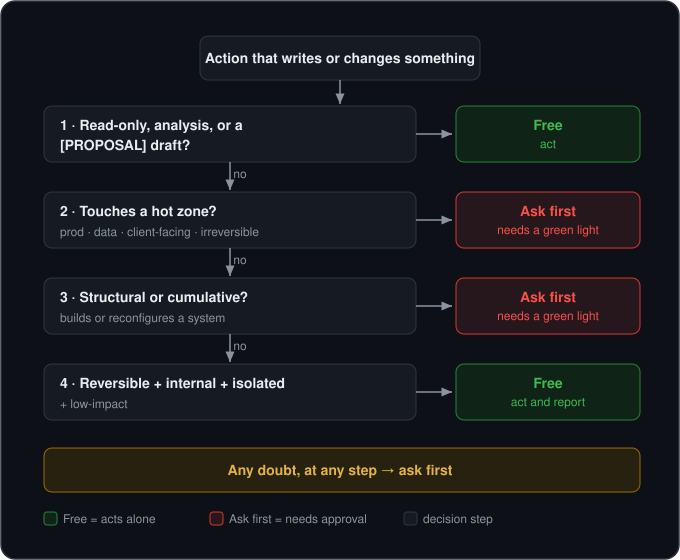

# Keel Skills — disciplined operations for Claude agents

> *Read this in [Spanish / Español](README.es.md).*

> A portable governance framework for running Claude agents (Claude Code, Agent
> SDK) without breaking things or burning tokens. Three skills + one command +
> one hook — install, configure per project, done.
>
> **Keel Skills is [Esteban Aguilar](#author)'s agent-governance methodology**,
> distilled from operating agents in production every day — not from theory.

A keel is the part of a ship you never see, the one that keeps everything stable
and on course. That's what this plugin does to an agent: it lets it move fast on
the safe stuff and **stops it cold before the irreversible**.


*The agent got "clean it up and push." Without a rule it just does it — delete,
force-push, done. With Keel it hits a risky zone, stops, and proposes a scoped plan,
flagging the unsafe delete. ([full walkthrough](examples/green-light-brake.md))*

> **In plain words.** AI assistants that write code can now act on their own — and
> sometimes they do something you can't undo, like permanently deleting work or
> publishing a change to the live system before anyone checked it. Keel Skills is a
> set of house rules: it lets the assistant handle the small, safe things by itself,
> but makes it **stop and ask you first** before anything risky or permanent. You
> stay in control without having to watch every step.

## The problem it solves

An autonomous agent is useful right up until it touches production, overwrites
something already published, runs a `push`/deploy that wasn't its call, or burns
your token budget running the most expensive model on a mechanical task. Most
teams have **no explicit rule** for when the agent may act alone and when it must
stop and ask. Keel Skills is that rule, already written.

You usually discover you needed it the day *after* the bad push. The point of
Keel Skills is to have it in place before that day.

## What's inside

Three skills (they trigger themselves when the situation calls for it), one
command, and one hook:

| Component | What it does |
|-----------|--------------|
| **`authorization-protocol`** skill | Decides whether the agent may act or must stop and ask. Sorts what looks like permission into three things — a goal, a method, and a green light (only a green light means go) — with a four-step check, risky "hot" zones, and a rule for following through on a green light you already have. |
| **`model-delegation`** skill | Pick the cheapest model that still preserves quality and risk control. Tiers by task type, max subagent depth, no self-escalation, cheapest-first tool ladder. |
| **`context-discipline`** skill | Keep the session anchored in files, not chat. When to end a long session, what to record, how to leave a resumable handoff. |
| **`/keel-skills:policy-init`** command | Generates your project's `AGENT_POLICY.md` by interviewing you about your hot zones and sources of truth. |
| **`SessionStart` hook** | If your project has an `AGENT_POLICY.md`, it's injected into context at the start of every session — so the policy no longer depends on the agent *remembering* to read it. |
| **`PreToolUse` hook** *(new in 0.4)* | The hard backstop. Inspects every tool call *before* it runs and stops a hot one (`git push`, deploy, `rm -rf`, writes to your hot paths, outward MCP calls) for explicit approval — even if the agent didn't stop itself. Logs every decision to `.keel/audit.jsonl`. |

## The permission model, at a glance

The core of Keel Skills: a four-step check that decides, before any action that
writes or changes something, whether the agent can act alone or must stop and ask
for a clear yes — a **green light**.



> Read-only and proposals are free. Anything **risky, outward, undoable-only-with-pain,
> or system-rebuilding** needs a green light. When in doubt, ask.

The model is specified runtime-neutral in **[SPEC.md](SPEC.md)** so it can be
cited and reimplemented outside Claude Code.

## Two layers: judgment and enforcement

Keel works in two layers, and you want both:

- **Soft (reasoning).** The skills make the agent *apply the test itself* and stop
  before hot work. Smart, context-aware — but it depends on the model choosing to
  comply.
- **Hard (enforcement).** The `PreToolUse` hook is deterministic code that
  intercepts hot tool calls and blocks them for approval *regardless* of what the
  model decided. It reads the concrete `hot_paths` / `hot_commands` from your
  policy's [machine-readable block](SPEC.md#71-optional-machine-readable-block-for-enforcing-implementations)
  (plus the SPEC §4 defaults), turns a hot action into an explicit approval
  prompt, and in a non-interactive run (CI) **denies** it outright since no human
  is there to approve. Every decision lands in `.keel/audit.jsonl`.

> **It is a backstop, not a sandbox.** Enforcement catches accidents, drift, and
> hallucinated actions — a huge lift in assurance — but a determined or
> jailbroken agent with shell access can still route around command matching.
> Real isolation (scoped credentials, a sandbox) is complementary; Keel does not
> replace it. We say this plainly so nobody leans on it as a security boundary.

## The key separation: mechanism vs. your data

The skills are **generic**: they describe the *pattern* (what a risky zone is, what
following through on a green light means, how a model gets chosen). Everything specific to
your project — which paths are hot, where your source of truth lives, what counts
as a release — lives in a single file you control: **`AGENT_POLICY.md`** at your
project root.

The result: the framework ships clean, with none of your company's data inside,
and each user configures it for their own work. The template is in
[`plugins/keel-skills/templates/AGENT_POLICY.template.md`](plugins/keel-skills/templates/AGENT_POLICY.template.md),
and ready-made packs for common stacks live in [`policies/`](policies/).

## Install

Keel Skills ships as a single-plugin marketplace.

```text
# In Claude Code:
/plugin marketplace add https://github.com/quitohooded/keel-skills
/plugin install keel-skills@keel-skills
```

Then, in your project:

```text
/keel-skills:policy-init
```

to generate the `AGENT_POLICY.md`. See [DISTRIBUTION.md](DISTRIBUTION.md) for the
publishing paths (git repo, local path, or package).

## See it in 60 seconds

A concrete before/after of the green-light brake — the agent about to force-push a
"cleanup", and Keel stopping it — is in
[`examples/green-light-brake.md`](examples/green-light-brake.md) (the **soft**
brake: the agent reasoning its way to a stop). The **hard** brake — the
`PreToolUse` hook intercepting the call and denying it when no human is present — is
in [`examples/enforcement.md`](examples/enforcement.md). The recordable demo script
is in [`examples/demo-script.md`](examples/demo-script.md).

## How to use it, in one line

> Read-only and proposals are free. Anything risky, outward-facing,
> undoable-only-with-pain or system-rebuilding needs a green light. When in doubt,
> ask. Cheapest model that does the job; shallow delegation; lightest tool first.

## Author

Created by **Esteban Aguilar** — [estebanaguilar.me](https://estebanaguilar.me)
· [github.com/quitohooded](https://github.com/quitohooded). Keel Skills distills
the judgment I use to operate agents in real work: when an agent can act alone and
when it has to stop, which model to assign to each task, and how to keep a session
anchored in files. If it helps you, tell me what you applied it to.

## Contributing

Policy packs for new stacks and implementations for other runtimes are very
welcome — see [CONTRIBUTING.md](CONTRIBUTING.md).

## License

**MIT.** Use it, fork it, build on it, including in commercial work. Keeping the
copyright notice is all MIT requires; a visible credit to *Keel Skills by Esteban
Aguilar* is the norm we ask you to follow (see [NOTICE](NOTICE)). © 2026 Esteban
Aguilar.
